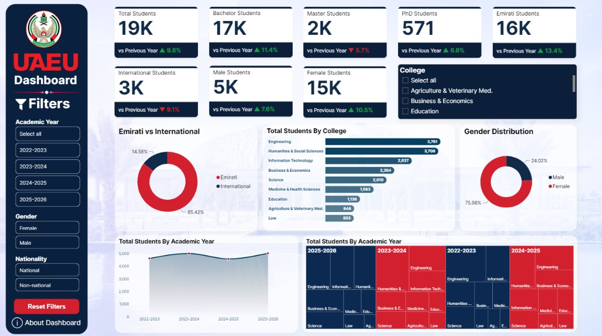

# uaeu-student-dashboard
Interactive Power BI dashboard visualizing UAE University (UAEU) student data — enrollment, demographics, and academic trends across 2022–2026. Includes filters by academic year, gender, nationality, and college, with insights on Emirati vs. international students, gender distribution, and college-wise breakdowns. Data sourced from bayanat.ae.

