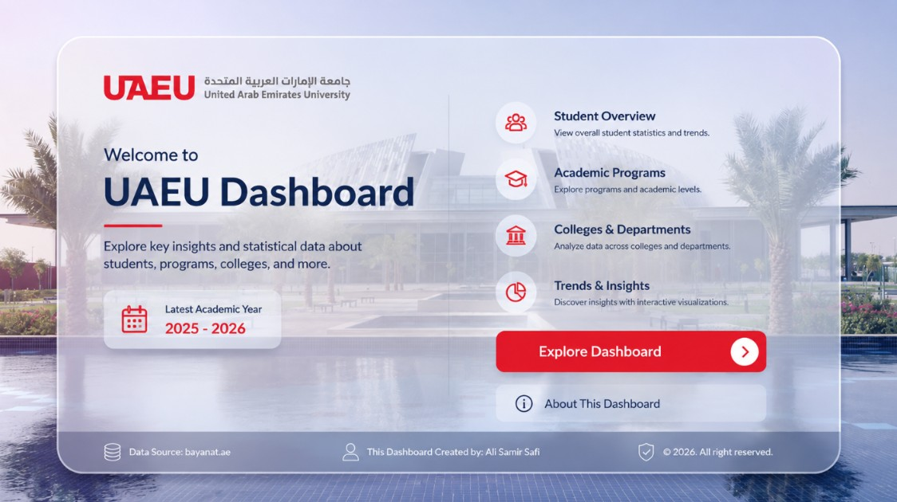
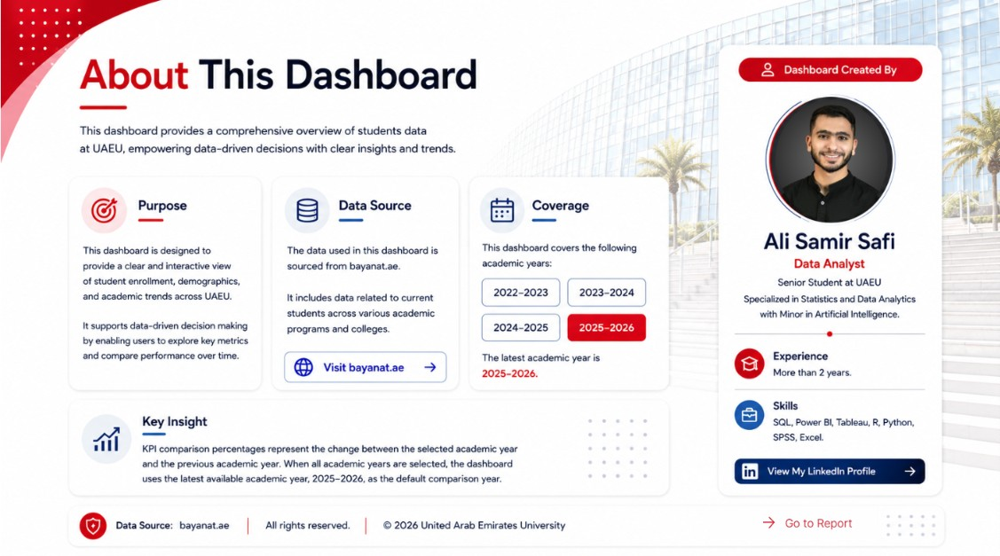

# UAEU Student Analytics Dashboard 

An interactive dashboard that visualizes student enrollment, demographic, and academic trend data for **UAE University (UAEU)** — built to make it easy to explore key metrics and compare performance across academic years.

🔗 **[View Live Dashboard](https://app.powerbi.com/view?r=eyJrIjoiNGZhMjM4NDEtZTcyOC00Nzk3LTlkMjYtNTZjMDIxMzc3YjdjIiwidCI6Ijk3YTkyYjA0LTRjODctNDM0MS05YjA4LWQ4MDUxZWY4ZGNlMiIsImMiOjh9&pageName=aa6612379922ae49f471)**

---

## 📌 About

This dashboard provides a comprehensive overview of student data at UAEU, empowering data-driven decisions with clear insights and trends.

---

## 📊 Dashboard Overview

---

## 🎯 Purpose

Designed to provide a clear and interactive view of student enrollment, demographics, and academic trends across UAEU. It supports data-driven decision-making by enabling users to explore key metrics and compare performance over time.

## 🗄️ Data Source

The data used in this dashboard is sourced from **[bayanat.ae](https://bayanat.ae)**. It includes data related to current students across various academic programs and colleges at UAEU.

## 📅 Coverage

This dashboard covers the following academic years:

- 2022–2023
- 2023–2024
- 2024–2025
- 2025–2026 *(latest)*

---

## 📊 Key Features

- **Summary Cards** — Total, Bachelor, Master, PhD, Emirati, and International student counts, each with year-over-year comparison.
- **Gender Distribution** — Breakdown of male vs. female students.
- **Emirati vs. International** — Donut chart comparing national and non-national students.
- **Total Students by College** — Bar chart ranking colleges by enrollment.
- **Total Students by Academic Year** — Trend line and treemap views across the four covered years.
- **Interactive Filters** — Filter by academic year, gender, nationality, and college.

---

## 🛠️ Tools & Technologies

Built with **Power BI**.

---

## 📬 Contact

Feel free to reach out or connect if you have questions or feedback about this project.
[LinkedIn Account](https://www.linkedin.com/in/alisamirsafi1/).

---

*Data sourced from [bayanat.ae](https://bayanat.ae) and [UAEU official website](https://www.uaeu.ac.ae/ar/open-data/report.shtml).*
